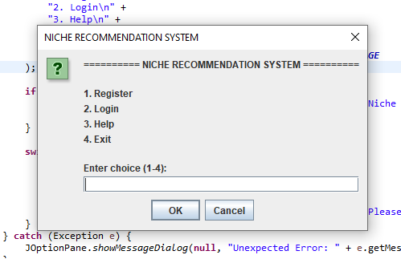
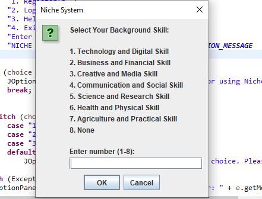
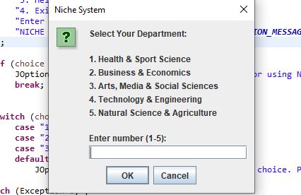
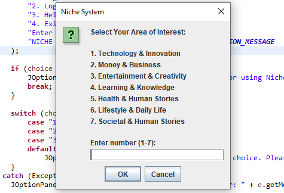
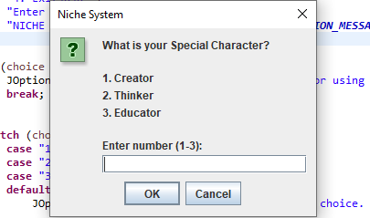
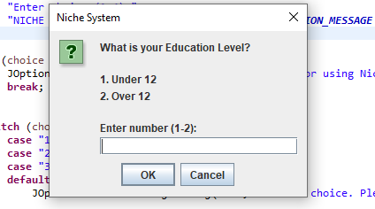
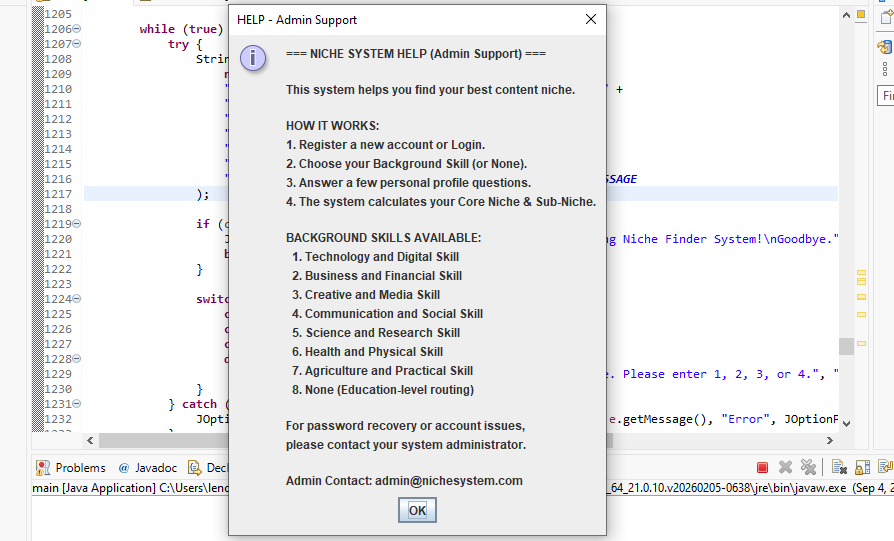
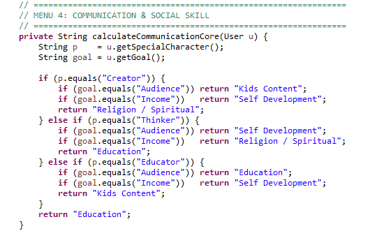
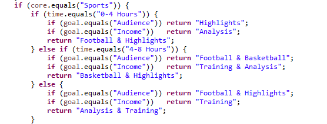
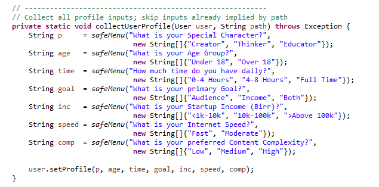

# Niche Recommendation System

A Java Swing-based GUI application that helps aspiring content creators discover suitable content niches based on their interests, skills, resources, and goals. 

Developed as a university Software Engineering project at Wachemo University, Department of Software Engineering, for the Object-Oriented Programming in Java course.

## 📌 Overview

Choosing the right content niche is one of the biggest challenges for aspiring content creators, especially on platforms like YouTube. Many creators struggle with unclear niche knowledge, uncertainty about market demand, conflicting personal interests, and confusion between passion and profitability.

The Niche Recommendation System was designed to solve this by guiding users through a short, structured profiling process and using that data to calculate a personalized **Core Niche** and **Sub-Niche** recommendation.

The system provides functionality for:

- User registration and authentication
- Background skill and interest-based profiling
- Department and education-level based routing (for users with no clear background skill)
- A rule-based recommendation engine covering 20+ niche categories
- Personalized Core Niche & Sub-Niche results
- Admin panel with user management and password recovery
- Built-in help and system guidance

### Recommendation Engine

The core of the project is a rule-based `RecommendationEngine` that maps a user's **Special Character** (Creator / Thinker / Educator), **Goal** (Audience / Income / Both), **Time Availability**, and other profile attributes onto a curated set of niche categories, including Technology, Business & Finance, Creative & Media, Communication & Social, Science & Research, Health & Physical, Agriculture & Practical, Arts & Social Sciences, Lifestyle, Entertainment, and Societal & Human Stories.

Users who don't have a clear background skill are routed through an alternate path based on education level (Under 12 / Over 12), optional department alignment (5 departments), or a general area of interest (7 categories), before reaching the same recommendation core.

> Note: The system uses a fixed, predefined ruleset and local text-file storage rather than a live database or external API. It is a simulation of a recommendation engine built to demonstrate object-oriented design principles rather than a production-ready analytics platform.

## ✨ Features

### 🔐 Authentication & User Roles

- User registration and login
- Role-based access (Standard User vs Administrator)
- Default admin account with password recovery support
- Simple file-based credential persistence

### 🧭 Profiling Workflow

- Background Skill selection (7 skills + "None")
- Education Level routing for users with no background skill (Under 12 / Over 12)
- Department selection (5 departments) for users who want department-aligned content
- Area of Interest selection (7 categories) for general-purpose routing
- Special Character, Age Group, Time Availability, Goal, Startup Income, Internet Speed, and Content Complexity profiling

### 🎯 Recommendation Engine

- Core Niche calculation across Technology, Business, Creative, Communication, Science, Health, Agriculture, Arts, Lifestyle, Entertainment, and Societal categories
- Sub-Niche calculation for more targeted content direction
- Final result summary with username, Core Niche, and Sub-Niche

### 🛠️ Admin Panel

- View all registered users
- Recover a user's password via a generated security token
- Access built-in system help
- Logout back to the main menu

### 📖 Help & System Guide

- Built-in help functionality explaining how the system works
- Lists all available background skills and workflow steps
- Admin contact information for account issues

## 🏗️ System Design

The system was analyzed and designed using standard object-oriented and software engineering principles, including:

- Abstraction (`Profile` abstract class)
- Encapsulation (`User` class with private fields and getters/setters)
- Inheritance (`Admin` extends `User` extends `Profile`)
- Composition (`Result` bundling a `User` and a `Niche`)
- Requirement Analysis and Problem Statement definition
- Scope and Limitations analysis

The complete project documentation, including the problem statement, objectives, scope, and system limitations, is available in the docs/ directory.

## 🛠️ Technology Stack

| Component                         | Technology            |
|-----------------------------------|-----------------------|
| Programming Language              | Java                  |
| GUI Components                    | Java Swing (JOptionPane) |
| Data Persistence                  | Local Text Files      |
| IDE / Development Environment     | NetBeans / Eclipse    |
| Operating System                  | Windows               |

## 📂 Project Structure

Niche-Recommendation-System/
├── README.md
├── LICENSE
├── .gitignore
├── main.java
├── docs/
│   └── Project-Documentation.pdf
└── images/
    └── screenshots/
        ├── login.png
        ├── background-skill-main-menu.png
        ├── none-main-menu.png
        ├── department-main-menu.png
        ├── intrest-main-menu.png
        ├── special-character-input-menu.png
        ├── help-main-menu.png
        ├── code-sample-one.png
        ├── code-sample-two.png
        └── code-sample-three.png

## ⚙️ Getting Started

### Prerequisites

- A Java Development Kit (JDK 8 or later)
- NetBeans, Eclipse, or another Java development environment
- Windows, macOS, or Linux operating system

### Setup

1. Clone the repository:

   ```
   git clone https://github.com/MinaXTech/Niche-Recommendation-System.git
   cd Niche-Recommendation-System
   ```

2. Open `main.java` in NetBeans, Eclipse, or another Java IDE.

3. Build and run the application.

### Compile Using javac

```
javac main.java
```

Run the application:

```
java niche_recommendation_system.main
```

The application uses local text files (`niche_users.txt`, `niche_admins.txt`) for user and admin data persistence.

## 👥 User Roles

| Role          | Permissions                                                                 |
|---------------|------------------------------------------------------------------------------|
| Administrator | View all registered users, recover user passwords, access system help        |
| Standard User | Register, login, complete profiling workflow, and receive niche recommendations |

The system provides different functionality according to the authenticated user's role, with a default administrator account (`admin` / `admin123`) created automatically if none exists.

## 📄 Documentation

The complete project documentation — including the problem statement, objectives, scope, system limitations, and design details — is available in the docs folder.

### Project Documents

- [Project Documentation](docs/Project-Documentation.pdf)

## 📸 Screenshots

### 🔐 Main Menu



### 🧠 Background Skill Selection



### 🏫 Department Selection



### 🌟 Area of Interest Selection



### 🧑‍🎨 Special Character Selection



### 🎓 Education Level Routing



### 📖 Help Menu



### 💻 Code Samples





## 👨‍💻 Contributors

- Minase Mengesha
- Natnael Andualem
- Naol Garomsa
- Natanim Chombe
- Amen Yehualashet

*Department of Software Engineering, College of Engineering and Technology, Wachemo University*

## 🎓 Academic Project

This project demonstrates the practical application of concepts learned in:

- Software Engineering
- Object-Oriented Programming in Java
- Requirements Analysis
- System Analysis and Design
- Rule-Based Recommendation Systems

## 📜 License

This project is licensed under the MIT License — see the [LICENSE](LICENSE) file for details.